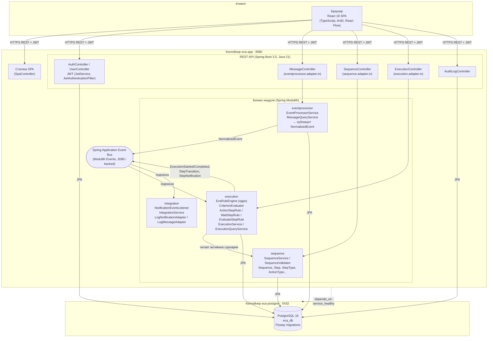
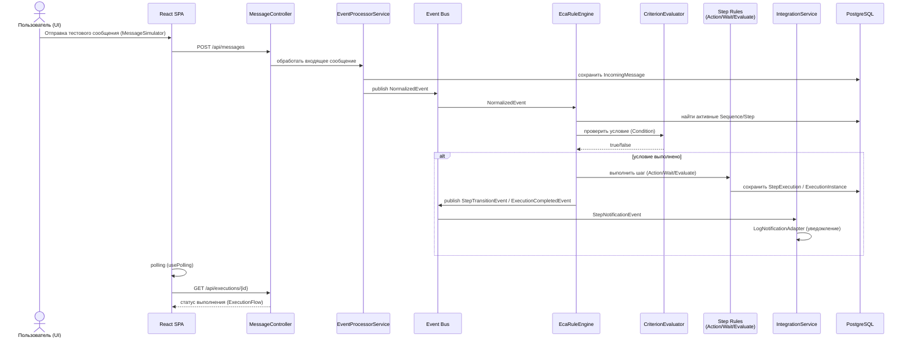

# Архитектура ECA System

## Диаграмма развёртывания и модулей

```mermaid
graph TB
    subgraph Client["Клиент"]
        Browser["Браузер<br/>React 18 SPA<br/>(TypeScript, AntD, React Flow)"]
    end

    subgraph AppContainer["Контейнер eca-app : 8080"]
        SPA["Статика SPA<br/>(SpaController)"]

        subgraph API["REST API (Spring Boot 3.5, Java 21)"]
            AuthAPI["AuthController / UserController<br/>JWT (JwtService, JwtAuthenticationFilter)"]
            MsgAPI["MessageController<br/>(eventprocessor.adapter.in)"]
            SeqAPI["SequenceController<br/>(sequence.adapter.in)"]
            ExecAPI["ExecutionController<br/>(execution.adapter.in)"]
            AuditAPI["AuditLogController"]
        end

        subgraph Modules["Бизнес-модули (Spring Modulith)"]
            EventProc["eventprocessor<br/>EventProcessorService<br/>MessageQueryService<br/>→ публикует NormalizedEvent"]
            SeqMod["sequence<br/>SequenceService / SequenceValidator<br/>Sequence, Step, StepType, ActionType..."]
            ExecMod["execution<br/>EcaRuleEngine (ядро)<br/>CriterionEvaluator<br/>ActionStepRule / WaitStepRule / EvaluateStepRule<br/>ExecutionService / ExecutionQueryService"]
            IntMod["integration<br/>NotificationEventListener<br/>IntegrationService<br/>LogNotificationAdapter / LogMessageAdapter"]
        end

        EventBus(["Spring Application Event Bus<br/>(Modulith Events, JDBC-backed)"])
    end

    subgraph DBContainer["Контейнер eca-postgres : 5432"]
        DB[("PostgreSQL 16<br/>eca_db<br/>Flyway migrations")]
    end

    %% Client to API
    Browser -->|"HTTPS REST + JWT"| SPA
    Browser -->|"HTTPS REST + JWT"| AuthAPI
    Browser -->|"HTTPS REST + JWT"| MsgAPI
    Browser -->|"HTTPS REST + JWT"| SeqAPI
    Browser -->|"HTTPS REST + JWT"| ExecAPI
    Browser -->|"HTTPS REST + JWT"| AuditAPI

    %% API to modules
    MsgAPI --> EventProc
    SeqAPI --> SeqMod
    ExecAPI --> ExecMod

    %% Event flow
    EventProc -->|"NormalizedEvent"| EventBus
    EventBus -->|"подписка"| ExecMod
    ExecMod -->|"читает активные сценарии"| SeqMod
    ExecMod -->|"ExecutionStarted/Completed,<br/>StepTransition, StepNotification"| EventBus
    EventBus -->|"подписка"| IntMod

    %% Persistence
    EventProc -->|"JPA"| DB
    SeqMod -->|"JPA"| DB
    ExecMod -->|"JPA"| DB
    AuditAPI -->|"JPA"| DB
    AuthAPI -->|"JPA"| DB

    %% Docker dependency
    AppContainer -.->|"depends_on:<br/>service_healthy"| DBContainer
```

## Диаграмма потока обработки события (sequence diagram)

```mermaid
sequenceDiagram
    actor User as Пользователь (UI)
    participant FE as React SPA
    participant MsgC as MessageController
    participant EPS as EventProcessorService
    participant Bus as Event Bus
    participant Engine as EcaRuleEngine
    participant CritEval as CriterionEvaluator
    participant Rules as Step Rules<br/>(Action/Wait/Evaluate)
    participant Integ as IntegrationService
    participant DB as PostgreSQL

    User->>FE: Отправка тестового сообщения (MessageSimulator)
    FE->>MsgC: POST /api/messages
    MsgC->>EPS: обработать входящее сообщение
    EPS->>DB: сохранить IncomingMessage
    EPS->>Bus: publish NormalizedEvent

    Bus->>Engine: NormalizedEvent
    Engine->>DB: найти активные Sequence/Step
    Engine->>CritEval: проверить условие (Condition)
    CritEval-->>Engine: true/false

    alt условие выполнено
        Engine->>Rules: выполнить шаг (Action/Wait/Evaluate)
        Rules->>DB: сохранить StepExecution / ExecutionInstance
        Engine->>Bus: publish StepTransitionEvent / ExecutionCompletedEvent
        Bus->>Integ: StepNotificationEvent
        Integ->>Integ: LogNotificationAdapter (уведомление)
    end

    FE->>FE: polling (usePolling)
    FE->>MsgC: GET /api/executions/{id}
    MsgC-->>FE: статус выполнения (ExecutionFlow)
```
