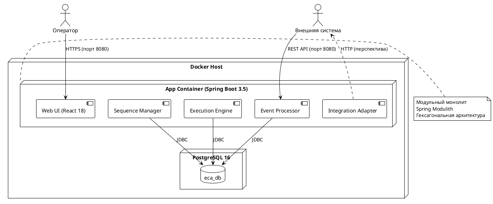

# ШАГ 10: ФИНАЛИЗАЦИЯ И ДОКУМЕНТАЦИЯ

## Что сделать:

### Swagger UI:
- Убедиться что все эндпоинты задокументированы на `/swagger-ui.html`
- Добавить описания через @Operation, @Tag, @ApiResponse к контроллерам
- Группировка по тегам: Sequences, Steps, Executions, Messages, Authentication, Users

### Spring Actuator:
- Проверить работу `/actuator/health`, `/actuator/info`, `/actuator/metrics`
- В `/actuator/info` — название системы, версия, описание:
```yaml
info:
  app:
    name: ECA System
    description: Event-Condition-Action system for aviation message processing
    version: 1.0.0
```

### Логирование — финальная настройка:
- Срабатывание ECA-правил → INFO
- Переходы между шагами → INFO
- Входящие сообщения → DEBUG
- Создание/завершение экземпляров → INFO
- Ошибки → ERROR с stacktrace
- Формат: `%d{yyyy-MM-dd HH:mm:ss} [%level] [%logger{36}] — %msg%n`

### PlantUML Deployment Diagram:

> **Требование ВКР.pdf (раздел 4.3):** Обоснование архитектурного стиля должно подкрепляться Deployment Diagram.

Создай файл `docs/deployment.puml`:



### README.md:
- Описание проекта и его назначения
- Технологический стек (кратко)
- Архитектура (модульный монолит, 5 модулей, гексагональная)
- Инструкция запуска: `docker-compose up --build`
- Дефолтные учётные данные: admin/admin
- Ссылки: Swagger UI (http://localhost:8080/swagger-ui.html), Actuator (/actuator/health)
- Описание демосценария (шаги для ручной проверки)
- Структура проекта (краткая)

### Docker — финализация:
- Frontend собирается при сборке Docker-образа (multi-stage build в Dockerfile) или обслуживается через Spring Boot static resources
- `docker-compose up --build` поднимает всю систему с нуля
- Healthcheck для PostgreSQL (pg_isready) и app (actuator/health)

### Финальный прогон:
1. `mvn verify` — все тесты зелёные
2. `docker-compose up --build` — система поднимается
3. Зайти на http://localhost:8080 — UI загружается
4. Логин admin/admin — работает
5. Демосценарий — проходит от начала до конца
6. Swagger UI http://localhost:8080/swagger-ui.html — показывает все API
7. Actuator http://localhost:8080/actuator/health — UP

## Критерий завершения:
Проект полностью работает из `docker-compose up --build`. README написан и актуален. Все тесты зелёные. Демосценарий работает через UI.

**Коммит:** `"Step 10: Finalization — Swagger docs, Actuator, Deployment diagram, README, Docker"`
